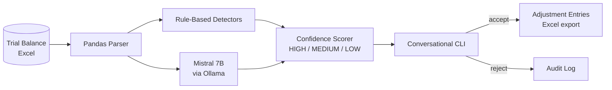

# Accounting Anomaly Detection

> ML-driven anomaly detection for accounting transactions — Mistral 7B local LLM with confidence-graded fix suggestions and human-in-the-loop conversational CLI.

## Problem

Accounting close cycles surface ledger anomalies (debit/credit inversions, missing zeros, sign flips, duplicates, typos) that are easy for an experienced accountant to spot but tedious to scan manually across thousands of journal entries. Automating this is delicate: false positives erode trust; false negatives create audit findings. Cloud LLM-based solutions raise data residency concerns for multi-entity multinationals; rule-based systems miss the long tail of pattern variations.

## Outcomes

- Detects six ledger error patterns: **debit/credit inversions, extra/missing zeros, sign flips, duplicate entries, typos, and pattern-based inconsistencies**.
- **Confidence grading** on every suggested fix: HIGH / MEDIUM / LOW — accountant decides which to apply.
- **Human-in-the-loop conversational CLI** keeps the operator in control; the LLM proposes, the human disposes.
- Automatic generation of **adjustment journal entries** when accepted, exported to Excel for ERP import.

## Architecture

## Key decisions

- **Local LLM (Mistral 7B via Ollama)** — eliminates data residency concerns. Trade-off: longer latency than cloud LLMs; gain: client data never leaves the operator's machine.
- **Hybrid rule-based + LLM detection** — rules catch the well-known patterns deterministically; LLM catches the long tail. Confidence scoring fuses both signals.
- **Human-in-the-loop conversational CLI**, not autonomous agent — accountants accept LLM-assisted, not LLM-replaced. Trust is earned by the LLM proposing and the human deciding.

## Technology stack

| Layer | Technology |
|---|---|
| LLM | Mistral 7B (local via Ollama) |
| Data | Pandas + OpenPyXL (Excel I/O) |
| Numerics | NumPy |
| Interface | Conversational CLI (Python) |

## Confidentiality

Implementation is private. The architecture and decisions are documented in full here. A version may be open-sourced as a standalone repo with synthetic data — see profile README for the public-source roadmap.

---

[← Back to index](./README.md) · [GitHub profile](https://github.com/fernandoxavier02) · [FX Studio AI](https://fxstudioai.com)
