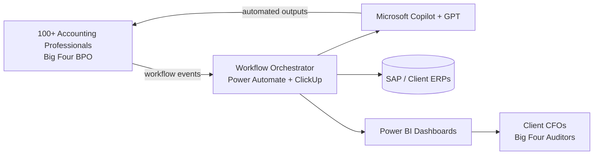

# Integrated Accounting Intelligence — Big Four BPO

*Production AI rollout at a Big Four BPO accounting practice. Employer name withheld for contractual confidentiality.*

> AI agentic workflow product (Microsoft + GPT) automating month-end close and reporting routines for the 100+ accounting professionals serving multinational BPO clients.

## Problem

A Big Four BPO accounting practice serves dozens of multinational clients. Each client has its own ERP, chart of accounts, intercompany matrix, and monthly close calendar. The 100+ accounting professionals on the team spent **dozens of hours per month per client** on repetitive workflow steps — reconciliation prep, variance analysis, intercompany matching, supporting schedules — that were obvious automation candidates but had never been mapped, prioritised, or shipped because the bandwidth needed for the discovery was the bandwidth being consumed by the manual work itself.

## Approach

Owned the AI automation product end-to-end:

1. **Discovery** — mapped the actual close-cycle workflows performed by the 100+ accounting professionals across the multinational BPO portfolio. Identified the highest-cost manual routines per workflow type (reconciliation, variance, intercompany, supporting schedules).
2. **Prototyping** — built Microsoft Copilot + GPT-driven automations targeting those highest-cost routines, iterating with the actual operators in the loop.
3. **Deployment** — rolled out across the multinational BPO client portfolio with governance via ClickUp + Power BI + SAP + Power Automate.
4. **Measurement** — instrumented the close cycle to capture before/after metrics.

## Architecture

## Key decisions

- **Start from the operator's pain, not the technology** — the discovery interview was with the accounting team, not with vendors. The automation targets came from observing the close cycle, not from listing what GPT can do.
- **Human-in-the-loop by default** — every AI-generated output flows back through an accountant before it lands in client deliverables. Trust through accuracy, not through autonomy. Errors in financial data have real downstream consequences (reporting, audits, compliance).
- **Reuse existing stack** — Power Automate, ClickUp, Power BI, SAP were already licensed and operated by the team. The automations integrated into those tools rather than introducing a new system to learn.
- **Governance first** — ClickUp tracks every automated action with audit trail; Power BI dashboards make adoption and impact visible to managers and clients.
- **Internal academy as adoption vehicle** — founded the Internal Academy in parallel, delivering executive education in accounting, compliance, and finance leadership. Turned the automation rollout into a sustained capability instead of a one-off project.

## Outcomes

- **70% reduction in manual accounting tasks** across the portfolio.
- **40% faster reporting cycles** measured end-to-end (from period close to client deliverable).
- Adopted by **100+ accounting professionals** across **7 manager teams**.
- The Internal Academy extended the impact — sustained capability rather than one-off automation.

## Technology stack

| Layer | Technology |
|---|---|
| AI | Microsoft Copilot + OpenAI GPT |
| Workflow orchestration | Microsoft Power Automate |
| Project management | ClickUp |
| BI / observability | Power BI |
| ERP integration | SAP and client-side ERPs |
| Education layer | Internal Academy |

## Confidentiality

Implementation details and per-client metrics are confidential under the Big Four BPO BPO contract. The portfolio-level metrics (70% / 40% / 100+ professionals) are documented and verifiable.

---

[← Back to index](./README.md) · [GitHub profile](https://github.com/fernandoxavier02) · [FX Studio AI](https://fxstudioai.com)
