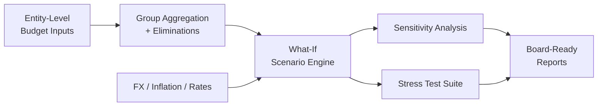

# Budget & Scenario Analysis

> Automated budget construction with what-if scenario modeling, sensitivity analysis, and stress testing for FX exposure, inflation, and interest rate shocks across LATAM entities.

## Problem

Annual budgeting in multi-LATAM-entity corporates collapses under three pressures: FX volatility (BRL, MXN, ARS, CLP), inflation regime shifts (Argentina especially), and inter-entity dependencies that single-entity budgets ignore. Spreadsheet budgets cannot ask "what if BRL devalues 20% AND inflation in AR runs at 200%?" without an analyst manually rebuilding the model. Budget conversations with the board lose credibility when the numbers cannot survive a 3-question stress test.

## Outcomes

- Automated **budget construction at entity level**, aggregated to group level with intercompany eliminations.
- **What-if scenario modeling** across FX, inflation, and interest rate dimensions.
- **Sensitivity analysis** identifying the top drivers of group-level variance.
- **Stress test suites** pre-built for: BRL devaluation, AR hyperinflation, USD rate hikes, multi-shock combinations.

## Architecture (high-level)

## Status

**Skeleton stage** — deep version with sensitivity examples and stress-test outcomes in preparation.

## Confidentiality

Implementation is private. Built for a multi-LATAM context including Argentine hyperinflation accounting (IAS 29).

---

[← Back to index](./README.md) · [GitHub profile](https://github.com/fernandoxavier02) · [FX Studio AI](https://fxstudioai.com)
