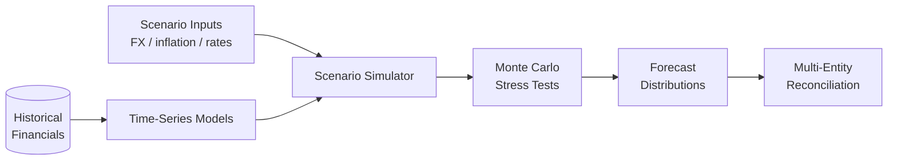

# Financial Forecasting Engine

> Predictive analytics for revenue, cash flow, and budget variance — time-series regression, scenario simulation, and Monte Carlo stress testing across multi-entity structures.

## Problem

FP&A teams in multi-entity multinationals need forecasts that hold up under stress (FX shocks, inflation surges, interest rate moves) — not just point estimates. Traditional spreadsheet forecasts give a number; they do not give a distribution, a confidence interval, or a stress test. Decisions made on point estimates over-promise to boards and miss the downside.

## Outcomes

- Time-series regression for revenue and cash-flow forecasting at entity level, aggregated to group level.
- Scenario simulation for FX, inflation, and interest rate shocks.
- Monte Carlo stress testing producing distributions, not point estimates.
- Multi-entity reconciliation so that group-level numbers tie back to entity-level inputs.

## Architecture (high-level)

## Status

**Skeleton stage** — deep version with model details and back-test evidence in preparation.

## Confidentiality

Implementation is private. Built for a multi-LATAM-entity context (BR / MX / CL / AR / PE) including Argentine hyperinflation accounting (IAS 29).

---

[← Back to index](./README.md) · [GitHub profile](https://github.com/fernandoxavier02) · [FX Studio AI](https://fxstudioai.com)
