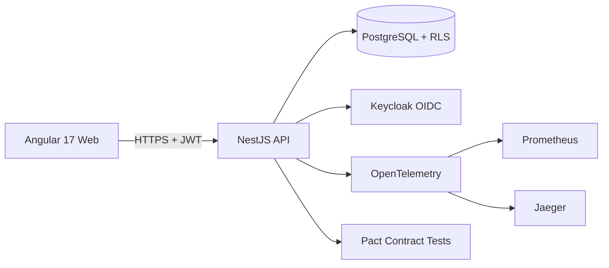

# IFRS 15 Revenue Recognition Platform

> Production-ready monorepo implementing the full IFRS 15 5-step revenue recognition model with multi-tenant architecture and audit logging.

## Problem

Multinational corporates running multiple revenue streams (subscriptions, professional services, licensing, milestone-based contracts) need to recognize revenue per IFRS 15 — but most existing solutions are either Excel macros (no audit trail, no multi-tenant) or enterprise ERP modules with 6-month implementation cycles. There is no middle ground for medium-sized multinationals or BPO providers serving multiple clients.

## Approach

Built a production-grade monorepo (NestJS backend + Angular 17 frontend + Prisma ORM + PostgreSQL with Row Level Security) that implements the full IFRS 15 5-step model:

1. **Identify the contract** — multi-party support, commercial substance verification, payment terms.
2. **Identify performance obligations** — distinct goods/services, bundle vs separate analysis, series of distinct goods.
3. **Determine transaction price** — variable consideration, significant financing components, non-cash consideration.
4. **Allocate transaction price** — standalone selling price allocation, residual approach when applicable, discount allocation.
5. **Recognize revenue** — point-in-time vs over-time recognition with progress measurement.

## Architecture

## Key decisions

- **Multi-tenant via Row Level Security at the DB layer**, not the application layer — tenant isolation is enforced by Postgres regardless of application bugs.
- **OIDC + RBAC with 5 roles** (admin_org, gerente_financeiro, contabilidade, auditor_externo, cliente) backed by Keycloak — the auditor_externo role is read-only by design, enforced at both API and DB levels.
- **Distributed tracing via OpenTelemetry + Jaeger** — every revenue recognition decision is traceable end-to-end for audit defense.
- **Pact contract tests** between API and frontend — catches breaking schema changes before deploy.
- **Domain-driven monorepo via NX workspace** — `packages/domain` holds pure IFRS 15 business logic, `packages/infra` handles persistence and RLS, `apps/api` and `apps/web` are thin shells.

## Technology stack

| Layer | Technology |
|---|---|
| Frontend | Angular 17 + Angular Material + i18n (pt-BR / en) |
| Backend | NestJS + TypeScript + Prisma ORM + Zod validation |
| Database | PostgreSQL 14+ with Row Level Security (RLS) |
| Auth | OIDC (Keycloak) + JWT + RBAC (5 roles) |
| Observability | Pino + OpenTelemetry + Prometheus + Jaeger |
| Testing | Jest + Vitest + Pact + Cypress E2E |
| Infrastructure | Docker Compose + NX monorepo |

## Outcomes

- Implements **all five IFRS 15 steps** including over-time recognition and progress measurement.
- **Audit logging** for every recognition decision and rule application.
- **Multi-tenant ready** — single deployment can serve N client tenants with full data isolation enforced by Postgres RLS.
- **CI/CD with Conventional Commits + Husky + ESLint + Prettier** — every commit gates code quality.

## Confidentiality

Code is private under client confidentiality. This document covers the architecture and decisions in full — sufficient for technical evaluation without breaching the underlying contract.

---

[← Back to index](./README.md) · [GitHub profile](https://github.com/fernandoxavier02) · [FX Studio AI](https://fxstudioai.com)
