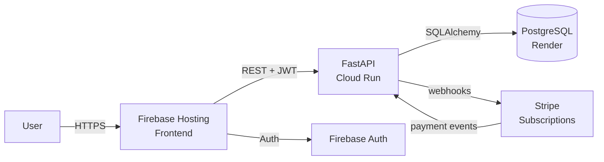

# IFRS 16 Lease Accounting SaaS

> Live B2B SaaS implementing IFRS 16 / CPC 06 (R2) lease accounting with subscription billing via Stripe webhooks.

**Live:** [ifrs16-calculator.web.app](https://ifrs16-calculator.web.app)

## Problem

IFRS 16 made every operational lease an on-balance-sheet asset and liability — for medium-sized companies with dozens of leases (vehicle fleets, real estate, equipment), the calculation overhead is non-trivial. Big Four firms charge enterprise rates; spreadsheet templates do not maintain an audit trail or handle modifications, indexations, or sublease scenarios cleanly. There is room for a self-service SaaS that does the math correctly and keeps the documentation auditable.

## Approach

Built a full-stack B2B SaaS:

- **Frontend:** Tailwind CSS on Firebase Hosting.
- **Backend:** Python 3.11+ FastAPI on Google Cloud Run.
- **Database:** PostgreSQL via SQLAlchemy ORM hosted on Render.
- **Billing:** Stripe with webhooks for subscription lifecycle (Basic / Pro / Enterprise tiers).
- **Auth:** JWT.
- **CI/CD:** pytest with coverage, automated deploys via Firebase + Cloud Run.

The application calculates: present value of lease payments, right-of-use asset, lease liability, amortisation schedule, and generates audit-ready reports — all conformant with IFRS 16 and CPC 06 (R2).

## Architecture

## Key decisions

- **Stripe webhooks for subscription state**, not polling — license tier and feature gating react to payment events in real time.
- **Multi-tenant licensing** via license keys validated at the API layer — single deployment, multiple customers.
- **Cloud Run + Render + Firebase** instead of a single cloud — chose best-of-breed for each layer; trade-off is more deployment surface, gain is operational cost (~$20/mo at MVP scale).
- **CPC 06 (R2) compliance alongside IFRS 16** — Brazilian accounting standard explicitly covered for LATAM customers.
- **CORS lockdown to the production frontend domain** — Cloud Run enforces `FRONTEND_URL` env-driven CORS at startup; no bypass even in staging.

## Technology stack

| Layer | Technology |
|---|---|
| Frontend | HTML5 + Tailwind CSS + JavaScript (ES6+) |
| Backend | Python 3.11+ FastAPI + SQLAlchemy 2.x + Pydantic |
| Database | PostgreSQL 14+ |
| Hosting | Firebase Hosting (frontend) + Google Cloud Run (backend) + Render (DB) |
| Payments | Stripe + webhooks (Basic / Pro / Enterprise tiers) |
| Auth | JWT + Firebase Auth |
| Testing | pytest + integration test scripts (PowerShell) |

## Outcomes

- Live in production at [ifrs16-calculator.web.app](https://ifrs16-calculator.web.app).
- **Stripe billing operational** — license validation and tier gating wired through webhooks; webhooks idempotent against retries.
- IFRS 16 + CPC 06 (R2) compliant calculations including initial recognition, subsequent measurement, and modification accounting.
- **Demonstrates end-to-end shipping** from accounting domain knowledge to a paying-customer-ready B2B product.

## Confidentiality

Frontend is publicly accessible at the URL above. Backend code is private. This case study documents the architecture and decisions in full.

---

[← Back to index](./README.md) · [GitHub profile](https://github.com/fernandoxavier02) · [FX Studio AI](https://fxstudioai.com)
