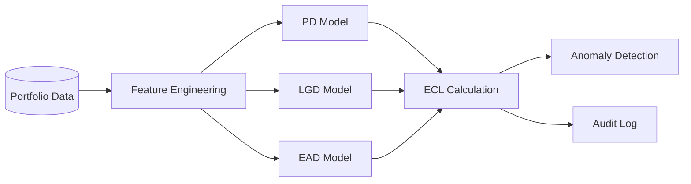

# IFRS 9 — ECL Models

> Expected credit loss prediction using regression and classification models — probability of default (PD), loss given default (LGD), exposure at default (EAD).

## Problem

IFRS 9 mandates forward-looking expected credit loss (ECL) estimation for financial assets — replacing the incurred-loss model of IAS 39. Mid-size lenders and corporate treasuries need PD / LGD / EAD models that are statistically defensible, auditable, and stable across economic cycles. Off-the-shelf solutions are priced for tier-1 banks; spreadsheet approaches do not survive audit.

## Outcomes

- PD / LGD / EAD modeling pipeline with regression-based and classification-based variants for comparison.
- Anomaly detection on the resulting portfolio risk signals to flag concept drift and model staleness.
- Audit trail for every ECL calculation including model version, input snapshot, and assumption set.

## Architecture (high-level)

## Status

This case study is at the **skeleton stage** — the deep version with model selection rationale, validation metrics, and cycle-stability evidence is in preparation.

## Confidentiality

Implementation is private. Methodology to be expanded in the deep version.

---

[← Back to index](./README.md) · [GitHub profile](https://github.com/fernandoxavier02) · [FX Studio AI](https://fxstudioai.com)
